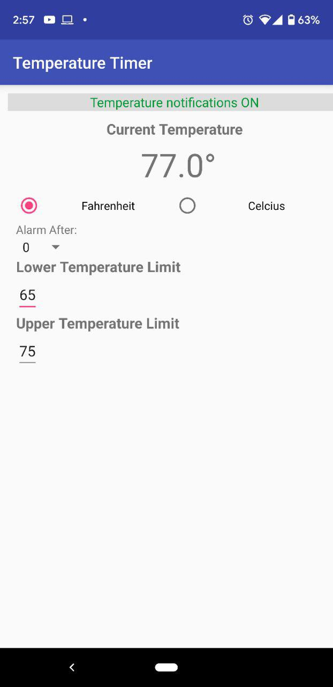

# Temperature Timer Milestone 2

## Summary  
In this second milestone I focused on the most important two most core elements of the project, those being the ability to connect to the BBC Micro Bit via Bluetooth in the app and reading a basic Temperature. Along with that I tried to implement various UI elements in preparation for features that are soon to come in the app such as the timer functionality, high/low temperature alarms, and database connections.

The base of this app utilizes some open source code from Martin Wooley's Micro Bit Blue application seen here:

https://github.com/microbit-foundation/microbit-blue

This code provides the BluetoothLE libraries and a basic interface for connecting to BBC Micro Bits and pulling data from it's various sensors. With this base I am creating my own interface for the temperature sensor that will allow for greater control and customization than what is provided in the stock pages.

The app I have so far will allow for connecting to BBC Micro Bit Devices, viewing current temperature date and converting that reading to
Farenheit or Celcius on the fly. I also have added the basic UI elements and functionality for the app to alarm the user when a temperature is out of range. The user sets a high and low temperature in the app and it will begin to vibrate if the temeprature goes above or below that range and (currently) will not stop until the range is changed or the temperature is brought back within range. While very crude, this does meet the minimum possible criteria for my user stories regarding temperature ranges. Additionally. This build also has a test implementation of the delay timer. Once the temperature goes out of range, it will wait for a hard-coded 10 seconds before beginning to vibrate. This timer is cancelled if the temperature gets back within range before the timer runs out to account for erroneous fluxuations in temperature. I currently have a drop down option for different times, but I have not yet implemented it's functionality.

## Going Forward
My primary objective for the coming final milestone is to thoroughly refine the basic functionality I curretnly have. On top of that, the biggest addition will be a local database that will be used to store different configured settings of temperatures and times. These saved settings will be able to be chosen from a scrolling menu. I also plan on having some form of user account control, but depending on time restrictions, this may need to be cut.
