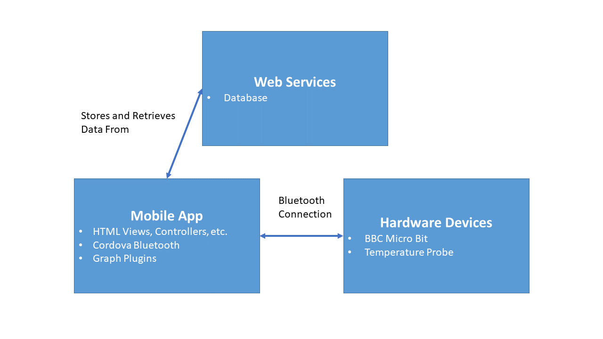
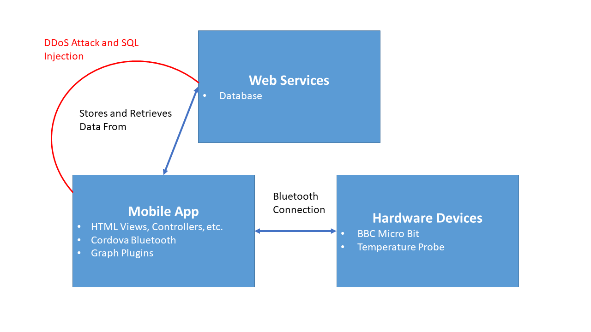

# TemperatureTimer  

## Executive Summary  
Whether it be by necessity of a job or the intrigue of an adventurer, there are many scenarios in which a person may be in a situation where they may need or want to put themselves or things in environments with extreme temperatures for an extended period. Be it high or low, many risks and dangers can come about from extreme temperatures that may result in a person becoming disorientated or lose track of how much time they or something has spent in that environment. This could range from a mascot performer wearing a costume during a hot game day, to someone trudging through a blizzard, to someone trying to cook something “sou vide” on the stove. Essentially, there are many scenarios in which someone may want to not only be alerted to a temperature status but also be timed regarding exposure to that temperature.  
For my project I am proposing an IOT based application that can sense temperature data in a variety of different environments for safety purposes. This app would allow the user to dial in either a predefined scenario, or a manually chosen time and temperature range and with the use of a Bluetooth enabled temperature sensor that would be placed inside the place to collect data or use a wired temperature sensing probe.  This sensor would send data to the user’s phone that would inform the user to their condition and send alert notifications advise them to take a break periodically to avoid being exposed to that temperature for too long. The sensor would be semi modular to account for situations where the whole device can be placed somewhere or when an external probe is necessary. 

## Project Goals  
In summary, the app will be capable of
* Pairing to the sensor device.
* Allowing the user to set a temperature limit to alert at
* Set a timer for permissible time to be expose to said temperatures  
* Notify user to the status of their exposure via an alarm (possibly with special sounds).  

## User Stories  
As a cook, I want to be able to measure the temperature of my water pot so I can cook food in it at a stable temperature.  
**Acceptance Criteria**  
* Sensor is inserted into pot via a wired probe.  
* If water goes above or below acceptable levels of heat, the app will alert the user to go correct it.  

As a mascot costume wearer, I want to be able to know the internal temperature of the costume over time so that I do not suffer heat stroke or other illness.  
**Acceptance Criteria**  
* Sensor can be placed inside costume or against body
* Sensor triggers app notifications after a set time period exposed to a dangerous temperature.  

As an artist, I want to be able to know the temperature of my garage that I am letting paint or clay dry because I don’t’ want them to be damaged by unsuitable temperature exposure.  
**Acceptance Criteria**  
* Sensor can be set on table in room for collecting air temperatures.
* Will alert user if sudden temperature changes occur.

## Misuser Stories  
As a hacker I want to be able to spoof the Bluetooth signal and introduce erroneous data to trick the application so that I can prevent the user from being alerted to the actual temperature.  
**Acceptance Criteria**  
* Stream data will be encrypted and utilize pairing keys to ensure that unknown devices can’t take it’s place.  
* Alert user if there is ever a break or interruption to the signal.  

As a cyber criminal I want to be able to exploit different sensor data from the app or IOT device beyond what it was intended to collect so that I can spy and track the user of the phone.  
**Acceptance Criteria**  
* App will be as limited as possible in the permissions that it asks for so that it does not erroneously request parts of the phones sensors that it does not need.

## High Level Design

## Component List
### Web Services  
This is where the major cloud based infrastructure will take place and be controlled by including database storage.

#### Database  
Will contain user profile data as well as information that the user desires to save such as specific configurations for timers and temperature settings.  

### Mobile App  
The main application itself that will run on the user’s mobile device which will provide the interface that the users interact with as they dial in the temperature and timers settings as well as the Bluetooth connectivity to the IoT devices.

#### HTML Views, Controllers, etc. 
Will contain the workings for the layout of the application interface as well as the code for processing the data that has been received, sending info to the database, and retrieving info from the database.  

#### Cordova Bluetooth LE
The Cordova plugin that will enable interfacing with the BBC Micro Bit or other IoT devices. It will not only connect with the devices but also retrieve the data sent from it and pass it onto the various controllers to be then used to calculate the various functions of the app.

#### Graph Plugins  
These libraries will enable graph displays of temperature information pertaining received from the sensors over time. This will help the user easily see trends in the temperature changes or lack therof.

### Hardware Devices  
These are the physical IoT devices and peripherals that the app will connect to in order to receive relevant sensor data for the application.  

#### BBC Micro Bit  
This is the microcontroller device of choice that will connect via Bluetooth to the mobile application and will perform the temperature sensing functionality and processing. It will be battery powered and small.  

#### Temperature Probe  
The long wire or external sensor that will connect to the BBC Micro Bit’s IO pins and will be what sits in direct contact with whatever thing or environment that needs temperatures taken from.  

## Security Analysis  
The main area of vulnerability for an application such as mine would be DDoS attacks towards the server that stores user data as well as exploitation of any sensitive information. Assuming that the Server utilizes a server such as AWS or other cloud-based system, then DDoS protection is already assumed and/or outside my direct control. The bigger issue would be encryption of user data.

| Component Name | Category of vulnerability | Issue Description                                                                                                                                                                                                                                                                                              | Mitigation                                                                                                                                              |
|----------------|---------------------------|----------------------------------------------------------------------------------------------------------------------------------------------------------------------------------------------------------------------------------------------------------------------------------------------------------------|---------------------------------------------------------------------------------------------------------------------------------------------------------|
| Database       | Information Disclosure    | This component stores user profile information as well as configuration settings. In the wrong hands this information may at best sabotoged in a mischeivious but not necessarily dangerous way, such as deleting user settings. At worst, sensitive personal information relating to the user may be exposed. | Data sent between the mobile app and the data servers should be encrypted in some way to prevent exploitation or stealing of meaninful data in transit. |
